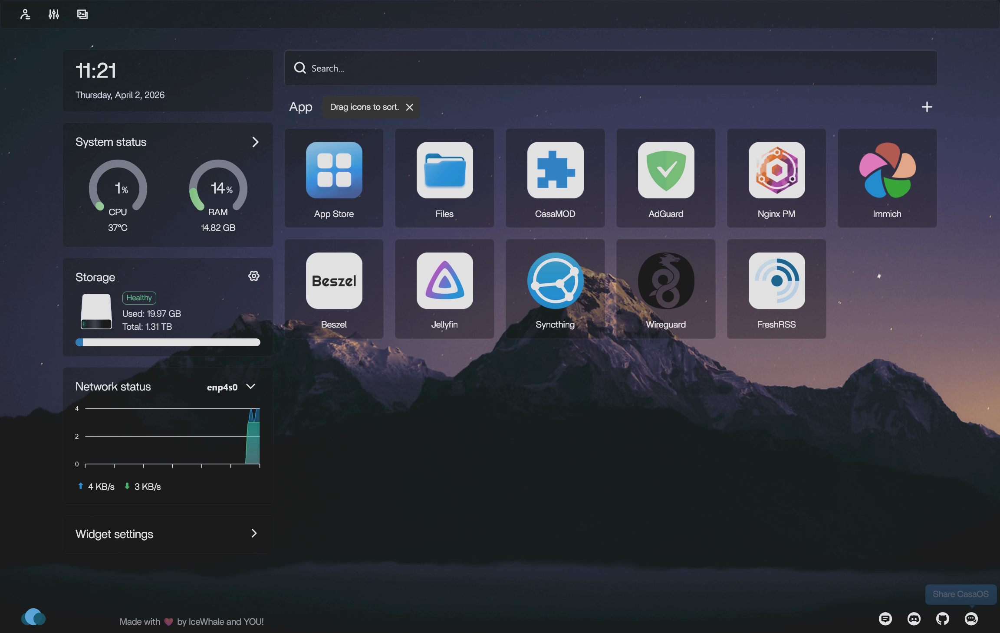
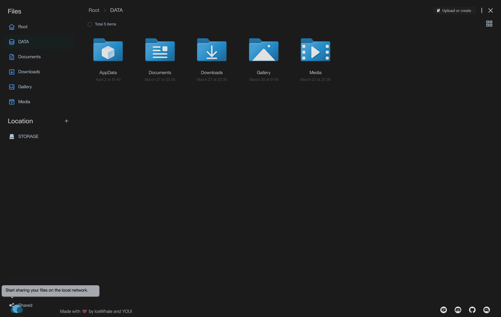
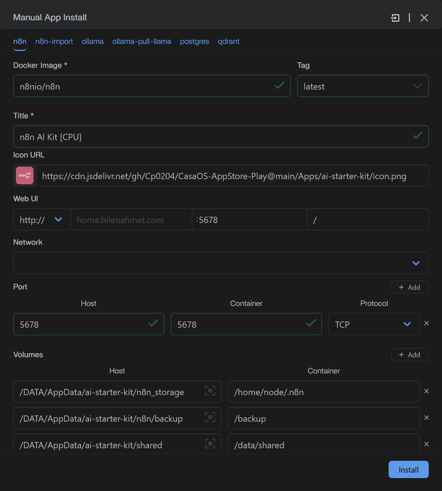
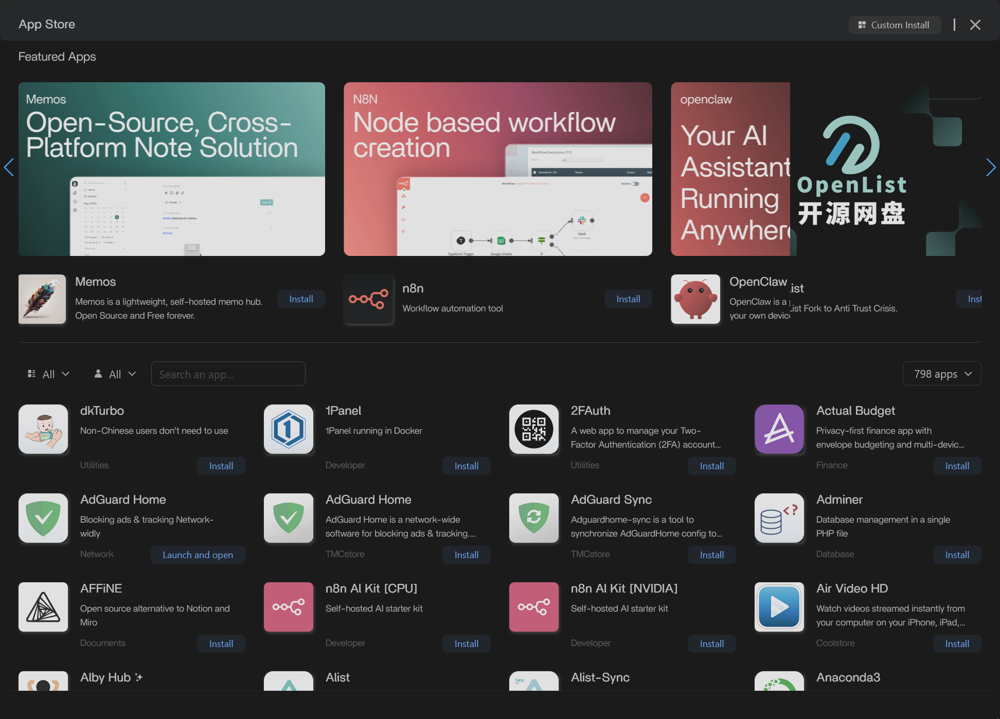
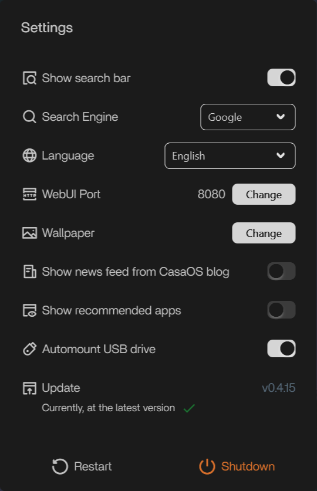

# CasaOS Dark Theme

Custom CSS theme for CasaOS, bringing a sleek dark mode experience

## Installation

### Method 1: Direct CSS Installation

Copy the contents of [custom.css](./custom.css) to `/var/lib/casaos/www/css/custom.css`

### Method 2: Browser Extensions

Use a CSS manager extension such as:

- Stylus
- Tampermonkey
  Or others

These allow you to apply the theme without modifying system files.

## Features

| Feature      | Preview                                                  |
| ------------ | -------------------------------------------------------- |
| Home         |          |
| File Browser |  |
| App Install  |   |
| App Store    |      |
| Settings     |      |

---

## Credits

**Inspired by & Thanks to:** [github.com/LitCastVlog/CasaOS-DarkMode](https://github.com/LitCastVlog/CasaOS-DarkMode)
